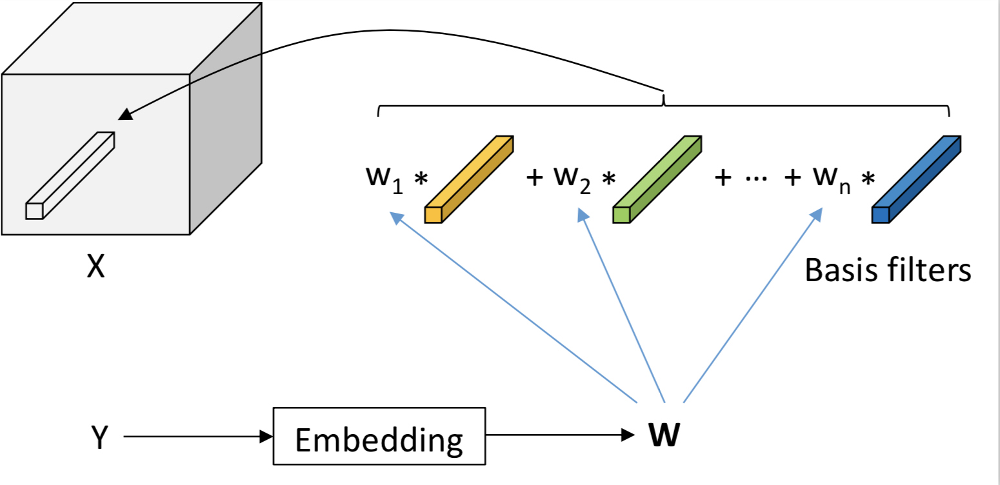

### Dynamic Conditional Networks for Few Shot Learning


- Pytorch implementation of the algorithm in our ECCV 2018 [Paper](https://www.researchgate.net/publication/326584672_Dynamic_Conditional_Networks_for_Few-Shot_Learning).


<p align="center">
  
</p>


## Getting Started
Clone the repo:

```
git clone https://github.com/ZhaoJ9014/Dynamic-Conditional-Networks-for-Few-Shot-Learning.pytorch.git
```

### Requirements

Tested under python3.

- python packages
  - pytorch>=0.3.1
  - Anaconda3
- An NVIDAI GPU and CUDA 8.0 or higher. Some operations only have gpu implementation.
- **NOTICE**: different versions of Pytorch package have different memory usages.


## Citation
- Please consult and consider citing the following paper:

      @inproceedings{zhao2018dynamic,
      title={Dynamic Conditional Networks for Few-Shot Learning},
      author={Zhao, Fang and Zhao, Jian and Yan, Shuicheng and Feng, Jiashi},
      booktitle={ECCV},
      pages={19--35},
      year={2018}
      }
